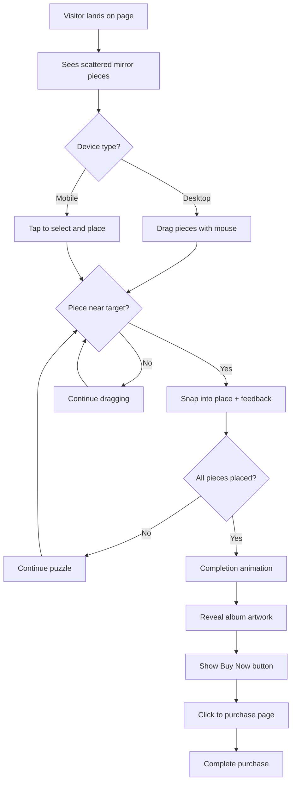

# Interactive Broken Mirror Puzzle - Implementation Plan

## Project Overview
An interactive web-based puzzle where visitors reassemble broken mirror pieces to unlock access to purchase your new record. Designed for seamless Squarespace integration.

## Recommended Technical Approach

### Solution: Standalone HTML/CSS/JavaScript Application
**Why this approach is optimal:**
- ✅ Most engaging user experience with drag-and-drop interaction
- ✅ Easiest Squarespace integration (single HTML file via Code Block or iframe)
- ✅ Mobile-friendly with touch support
- ✅ No backend/server required - runs entirely in browser
- ✅ Easy to maintain and update
- ✅ Works across all devices and browsers

---

## Design Decisions

### 1. Mirror Piece Strategy: **Stylized SVG Shards** (Recommended)

**Advantages:**
- More visually striking and artistic
- Precise interaction boundaries for dragging
- Scalable without quality loss (vector graphics)
- Better performance across devices
- Can add CSS reflective effects for authentic mirror appearance
- Easier to implement rotation and snapping mechanics

**Alternative Option:** Photo-based pieces
- If you have a meaningful broken mirror photo tied to your album
- Requires image slicing and more complex collision detection
- May be less precise on mobile devices

**Recommendation:** Start with stylized SVG shards (6-8 pieces) for best user experience

---

### 2. Puzzle Mechanics

#### User Experience Flow
```
1. Visitor lands on page
   ↓
2. Sees scattered mirror shards with subtle shimmer effect
   ↓
3. Instruction appears: "Piece together the mirror to unlock"
   ↓
4. User drags/taps pieces to correct positions
   ↓
5. Pieces snap into place with satisfying feedback (sound + visual)
   ↓
6. When complete, mirror "reflects" album artwork
   ↓
7. "Buy Now" button appears with link to purchase page
```

#### Interaction Methods
- **Desktop**: Drag-and-drop with mouse
- **Mobile/Tablet**: Touch drag or tap-to-rotate then tap-to-place
- **Accessibility**: Keyboard navigation support

#### Puzzle Difficulty
- **Easy Mode** (Recommended): 6-8 large pieces, rotation not required
- **Medium Mode**: 8-12 pieces with rotation
- **Hard Mode**: 12+ pieces with rotation and no guides

**Recommendation:** Easy mode for maximum conversion - you want fans to reach the purchase link!

---

### 3. Completion Detection & Unlock Mechanism

#### Detection Logic
```javascript
// Pseudo-code
Each piece has:
- Current position (x, y)
- Target position (x, y)
- Tolerance threshold (e.g., 20px)

When piece is within threshold of target:
- Snap to exact position
- Lock in place
- Play success sound/animation

When all pieces locked:
- Trigger completion sequence
- Reveal purchase button
```

#### Unlock Options
1. **Direct Link**: Button appears linking to Squarespace product page
2. **Password Reveal**: Display a discount code for checkout
3. **Email Capture**: Optional - collect email before revealing link
4. **Social Share**: Encourage sharing before unlocking (optional)

**Recommendation:** Direct link for simplest user experience

---

### 4. Visual Design Elements

#### Mirror Aesthetic
- Reflective gradient effects using CSS
- Subtle shimmer/glint animations
- Glass-like transparency and shadows
- Crack patterns at shard edges
- When complete: Reflects album artwork or artist photo

#### Color Scheme
- Silver/chrome mirror tones
- Dark background to make mirror pieces pop
- Accent color matching your album branding
- Glow effects on hover/active pieces

#### Animations
- Pieces gently float/rotate when scattered
- Smooth drag motion with momentum
- Satisfying "snap" when placed correctly
- Completion celebration (particles, flash, sound)

---

### 5. Mobile Responsiveness Strategy

#### Responsive Breakpoints
- **Desktop** (>1024px): Full drag-and-drop experience
- **Tablet** (768px-1024px): Touch-optimized with larger hit areas
- **Mobile** (<768px): Simplified layout, tap-to-select interaction

#### Mobile Optimizations
- Larger touch targets (minimum 44x44px)
- Simplified piece count (6 pieces max on mobile)
- Vertical layout for portrait orientation
- Reduced animations for performance
- Touch feedback (haptic if supported)

#### Performance Considerations
- Lazy load assets
- Optimize SVG file sizes
- Use CSS transforms for smooth animations
- Debounce drag events
- Minimal JavaScript bundle size

---

## Implementation Roadmap

### Phase 1: Core Puzzle Development
**Files to create:**
```
mirror-puzzle/
├── index.html          # Main puzzle page
├── styles.css          # All styling and animations
├── puzzle.js           # Puzzle logic and interactions
├── assets/
│   ├── mirror-pieces/  # SVG shard files
│   ├── sounds/         # Audio feedback (optional)
│   └── album-art.jpg   # Revealed image when complete
└── README.md           # Setup instructions
```

**Key Components:**
1. HTML structure with puzzle container
2. CSS for mirror effects and responsive layout
3. JavaScript for drag-and-drop mechanics
4. Collision detection and snapping logic
5. Completion detection and unlock reveal

### Phase 2: Squarespace Integration
**Integration Methods:**

#### Option A: Code Block (Recommended)
```html
<!-- Paste in Squarespace Code Block -->
<div id="mirror-puzzle-container"></div>
<script src="path/to/puzzle.js"></script>
<link rel="stylesheet" href="path/to/styles.css">
```

**Pros:**
- Native integration
- Maintains Squarespace navigation
- SEO-friendly

**Cons:**
- Limited styling control
- May conflict with Squarespace CSS

#### Option B: Embedded iframe
```html
<!-- Paste in Squarespace Code Block -->
<iframe 
  src="path/to/mirror-puzzle/index.html" 
  width="100%" 
  height="800px" 
  frameborder="0"
  style="border:none;">
</iframe>
```

**Pros:**
- Complete isolation from Squarespace styles
- Full control over appearance
- Easy to update independently

**Cons:**
- Requires external hosting (GitHub Pages, Netlify, etc.)
- Slight loading delay

#### Option C: Squarespace Custom CSS/JS
- Upload files to Squarespace's Custom CSS and Advanced > Code Injection
- Most integrated but requires Squarespace Business plan or higher

**Recommendation:** Start with iframe approach for easiest setup and full control

### Phase 3: Hosting & Deployment
**Hosting Options:**
1. **GitHub Pages** (Free, recommended)
   - Create repository
   - Enable GitHub Pages
   - Get public URL for iframe

2. **Netlify** (Free tier available)
   - Drag-and-drop deployment
   - Custom domain support
   - Automatic HTTPS

3. **Squarespace File Storage** (If Business plan)
   - Upload directly to Squarespace
   - No external hosting needed

### Phase 4: Testing & Refinement
- Cross-browser testing (Chrome, Safari, Firefox, Edge)
- Mobile device testing (iOS, Android)
- Performance optimization
- User testing with friends/fans
- Analytics integration (optional)

---

## Technical Specifications

### Browser Support
- Chrome 90+
- Safari 14+
- Firefox 88+
- Edge 90+
- Mobile Safari (iOS 13+)
- Chrome Mobile (Android 8+)

### Dependencies
**Minimal approach (Recommended):**
- Vanilla JavaScript (no frameworks)
- Pure CSS animations
- No external libraries

**Enhanced approach (Optional):**
- Interact.js for advanced drag-and-drop
- GSAP for premium animations
- Howler.js for audio management

**Recommendation:** Start with vanilla JavaScript for simplicity

### File Sizes (Target)
- HTML: <5KB
- CSS: <15KB
- JavaScript: <30KB
- SVG pieces: <5KB each
- Total initial load: <100KB

---

## User Experience Enhancements

### Optional Features
1. **Progress Indicator**: Show X/8 pieces placed
2. **Hint System**: Highlight correct position after 30 seconds
3. **Timer**: Challenge users to complete quickly
4. **Leaderboard**: Track fastest completion times
5. **Sound Effects**: Satisfying audio feedback
6. **Particle Effects**: Celebration on completion
7. **Social Sharing**: "I unlocked [Album Name]!"
8. **Easter Eggs**: Hidden messages in mirror reflections

### Accessibility Features
- Keyboard navigation (Tab, Arrow keys, Enter)
- Screen reader announcements
- High contrast mode support
- Reduced motion option
- Clear focus indicators

---

## Content Requirements

### Assets Needed
1. **Album artwork** (high resolution, square format)
2. **Purchase page URL** (Squarespace product link)
3. **Brand colors** (hex codes for styling)
4. **Optional**: Custom font matching your brand
5. **Optional**: Background music/ambient sound
6. **Optional**: Broken mirror photo (if using photo-based approach)

### Copy/Text
- Puzzle instructions (e.g., "Piece together the mirror to unlock")
- Completion message (e.g., "The mirror is whole. Your journey begins.")
- Button text (e.g., "Pre-Order Now", "Buy Album")
- Optional: Artist statement or album description

---

## Timeline Estimate

### Development Phases
- **Phase 1** (Core Puzzle): 2-3 days
- **Phase 2** (Squarespace Integration): 1 day
- **Phase 3** (Hosting Setup): 1 day
- **Phase 4** (Testing & Polish): 1-2 days

**Total**: 5-7 days for complete implementation

### Quick Launch Option
- Simplified version (6 pieces, basic styling): 2-3 days
- Can enhance with additional features post-launch

---

## Success Metrics

### Key Performance Indicators
- Completion rate (% of visitors who solve puzzle)
- Time to complete (average)
- Click-through rate to purchase page
- Mobile vs. desktop engagement
- Bounce rate on puzzle page

### Optimization Goals
- >70% completion rate
- <2 minutes average solve time
- >50% click-through to purchase
- <5 second initial load time

---

## Next Steps

1. **Review this plan** - Confirm approach aligns with your vision
2. **Gather assets** - Collect album artwork, brand colors, purchase URL
3. **Choose complexity** - Decide on piece count and difficulty
4. **Select hosting** - GitHub Pages vs. Netlify vs. Squarespace
5. **Switch to Code mode** - Begin implementation

---

## Mermaid Diagram: User Flow



---

## Questions for Refinement

Before moving to implementation, consider:

1. **Piece count**: 6 pieces (easy) or 8-10 pieces (moderate)?
2. **Rotation**: Should pieces need to be rotated to fit?
3. **Reveal image**: Album cover or artist photo in completed mirror?
4. **Sound**: Include audio feedback or keep silent?
5. **Difficulty**: Include hint system or let users figure it out?
6. **Analytics**: Track user behavior for insights?

---

## Conclusion

This approach provides the optimal balance of:
- **Engagement**: Interactive and memorable experience
- **Simplicity**: Easy to implement and maintain
- **Compatibility**: Works seamlessly with Squarespace
- **Performance**: Fast loading and smooth interactions
- **Accessibility**: Usable across all devices and abilities

The standalone HTML/CSS/JavaScript solution with iframe embedding gives you complete creative control while remaining simple to deploy and update.

Ready to proceed? Switch to Code mode to begin building your interactive mirror puzzle!